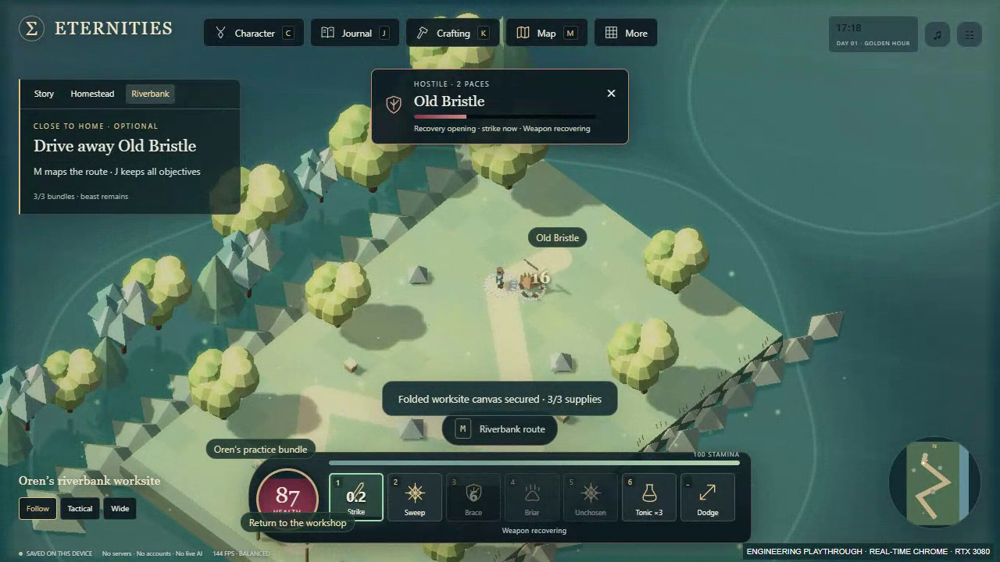

# Starter-region implementation and evidence

## Reference and delivery

Dom authorized [Astra's PR #4 assignment](https://github.com/xnuonux/eternities-firstlight/pull/4#issuecomment-5649865206). Reviewed base: `aa4e21056219768b24b3f36d2f60671a6a831fb6`, branch `import/firstlight10-bootstrap-20260912`. Gameplay branch: `gameplay/starter-region-progression`, in a separate worktree. This review stacks against the import branch while PR #4 remains unmerged. Main was observed at `1aae2f14f2b2ab0ba54a5bf8571bd45bbf32ab46`; no merge, tag, deployment, force push, old import-workflow activation or personal-save access.

The task note was committed before implementation at `5277c19`. Atomic quest/migration rules: `c40f087`. Combined playable UI/art/combat and test implementation: **`6c23d4730b265df0bc008e472f02d868aae3c5fb`**. Later delivery commits hold records, labelled fixtures, measurement and footage. The implementation PR contains the exact final pushed head and final remote-clone/hosted receipts. These references do not imply main has acquired the code.

Both generated HTML outputs are identical: **520,868 bytes**, SHA-256 **`f7bb18dd5f3bd80f3d033af14a782c826129721755c0bd37048620cc6c900656`**. This is the actual document served to the final GPU measurement and recording.

## What is playable

After the initial expedition kit, Oren offers three individually identified riverbank supplies and Old Bristle on the same short route, with two ordinary skitters. Acceptance shows route, danger and all reward comparisons. M/J track the outing; objectives survive reload independently and in either order. The return stacks supplies beside the workshop and acknowledges completion.

Choose a fixed early blade, fixed early bow or exactly one +2 temper on one explicitly selected owned weapon, plus 25 XP and six sunmarks. The finite temper preserves identity/socket and is not repeatable. Capacity/refusal/duplicate checks precede mutation. New gear does not auto-equip. The fixed rewards remain weaker than copper gear and Dawn's edge; full comparisons include cooldown, reach, stamina, socket, guard and HP. The [pre-implementation matrix](STARTER_REGION_TASK_2026-09-12.md) distinguishes same-level comparisons from XP gained on the outing.

Weapon classification now uses the validated combined catalogue. The new bow travels, collides, misses and performs its piercing skill through real rules. Autoattacks face the selected enemy and anticipate 0.12 seconds before a legal hit while retaining 0.52-second blade / 0.75-second bow cadence. Confirmed impacts drive feedback. Click selects stationary autoattack; movement remains explicit. Old Bristle's fixed 90 HP, 1.25-second locked warning and 1.8-second recovery support both brace and movement. Actual warning geometry matches the rule radius. Reduced motion suppresses added recoil, sweeping weapon motion and drifting numbers.

World schema/key remain 9; adventure changes 5→6 with nested starter version 1. Old supported adventures chain through migration. XP boundaries 0/29/30/79/80/149/150/259/260/9999 retain their values and the 1–5 curve. Existing saves retain creative/home/crops/inventory/equipment/sockets/companion/campaign/soul state; safe exterior reload behavior is unchanged. Personal saves and file-origin migration were not tested.

## Verification

Commands are portable from a checkout with Python and Node:

```text
python tools/verify.py
python tools/verify.py --browser
```

The optional browser environment uses `requirements-dev.txt` and Playwright Chromium, documented in `tests/README.md`. Default CI browser rendering is SwiftShader, not RTX.

| Gate | Observed result |
|---|---|
| Node rules | 432 passed, 0 failed/skipped |
| JavaScript syntax | 27 modules passed |
| Python helpers on Windows | 19 passed, 1 explicit symlink-privilege skip |
| Existing Chapter IV | Blade and bow command journeys passed |
| New fresh outing | Blade and command-crafted bow passed pickup, defeat, claim, equip, practice and reload stages |
| Strongest veteran | All four campaign chapters freshly earned: 77 + 32 + 52 + 39 accepted campaign commands, then starter temper 42→44; guard 13 / max HP 200 retained |
| Crossing browser | 115 checks passed |
| Prior gameplay browser | 106 checks passed |
| Cutaway / reflection browser | 6 / 8 checks passed |
| Native-origin browser restart | 11 checks passed |
| Starter browser | 147 checks passed, including visible blade/bow completion, native reload phases, veteran temper, bow skill and atomic capacity refusal |

The veteran migration is explicitly labelled: command-earned four-chapter data represented in the legacy adventure-5 shape before construction of a new Simulation. No inventory, defeat, ownership or consent flags are planted. Independent synthetic boundaries test XP limits, capacity, socket retention and malformed states. An accepted command journey is not a human playtest. Final exact-head clean-clone and hosted results are recorded in the PR receipt after pushing.

All six current browser suites reported zero unhandled JavaScript errors. Prior gameplay checks retain music and MIDI/WAV/save exports, construction, companions, menus, maps and explicit soul choices. The first combined run stopped at the old cinder assertion: the final aegis cast still occupied the shared spirit cooldown. Diagnostics showed the game correctly refused early cinder. The test now waits for the existing cooldown before replay; it passes without weakening the rule. Initial new-feature red tests and fixture/test expectation corrections remain in ignored local logs; they are not reported as passes. A cosmetic trailing space was removed before the recorded HTML hash above.

## Actual footage and desktop measurement

[Watch the actual 46.8-second outing](../evidence/starter-region/starter-outing.webm). [Recording provenance](../evidence/starter-region/GAMEPLAY_RECORDING.json) identifies the source hash, earned checkpoint, browser, fights and final quest state. This is automated input on normal real-time RAF: acceptance, three pickups/fights, return, deliberate reward/equip and practice. It is silent VP8 at 1280×720, encoded at 25 fps. Encoding rate and the in-game FPS label are not performance certifications. No generated concept art or fabricated gameplay is used.



[Separate GPU report](../evidence/starter-region/GPU_DESKTOP_REPORT.json): Windows desktop, Ryzen 9 9900X / 32 GB, Chrome **153.0.8010.36**, NVIDIA RTX 3080 10 GB via **ANGLE Direct3D11**, driver **32.0.16.1074 / 610.74**. CDP and WebGL both identify the NVIDIA hardware path. Isolated headless Chrome, **1920×1080 viewport**, balanced quality, 1.5-second warmup, **600 normal RAF intervals per scene**:

| Observed scene | p50 | p95 | p99 | Maximum | >33.3 / >50 ms |
|---|---:|---:|---:|---:|---:|
| Firstlight village, water/residents | 6.9 ms | 7.0 ms | 7.0 ms | 7.1 ms | 0 / 0 |
| Riverbank bow practice, projectiles/reflections | 6.9 ms | 7.0 ms | 7.1 ms | 7.1 ms | 0 / 0 |
| Completed Bellweather, companion | 6.9 ms | 7.0 ms | 7.0 ms | 7.1 ms | 0 / 0 |

This short sample measures browser frame intervals, not GPU render duration or a broad performance guarantee. No sampled stutter crossed the stated thresholds. It does not establish physical display latency, all scenes/settings, extended-session performance, human enjoyment or Unreal qualification. An earlier hardware probe and software-WebGL probe are exploratory evidence, not this final measurement.

## Review and remaining acceptance

Targeted independent reads of the quest/migration and combat integration returned no actionable findings; their narrow scope is not a complete code audit. Astra can inspect the diff and receipts independently. Source ownership, baseline charter and original creative systems remain intact.

Dom's fresh and returning playtests are still pending: **did you know where to go, did the fights feel better, did the reward make you want another outing?** The robot completes the route quickly with known paths; this does not establish the proposed 10–20 minute fresh-player pace. Names/dialogue/art/balance remain working choices. No personal-save validation, file-origin certification, physical-phone test or Unreal compile/performance claim is made. See `NEXT_TASK.md` for the bounded follow-up.
