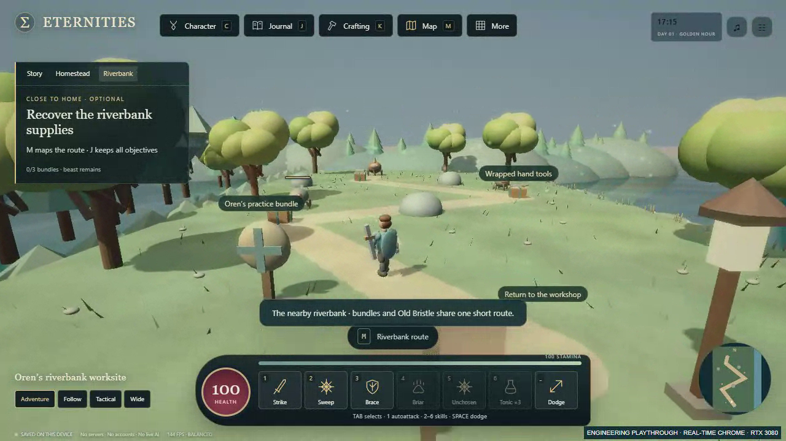
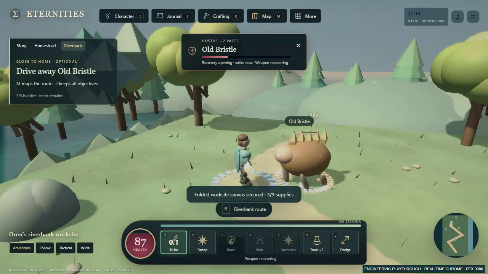
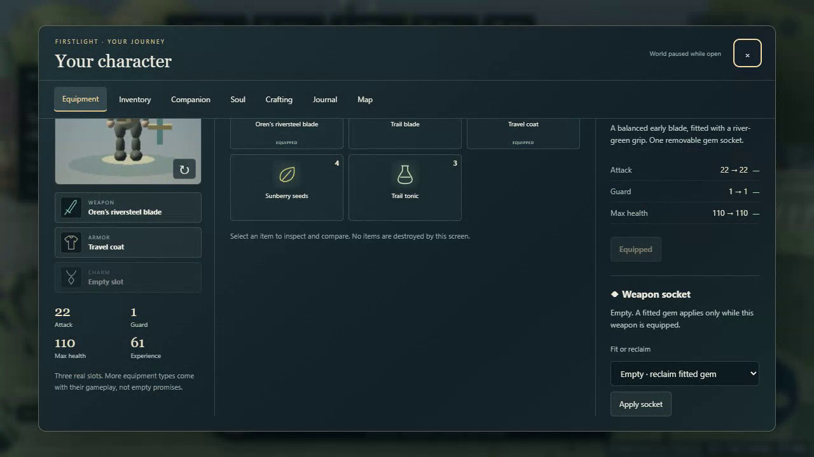

# Actual third-person gameplay evidence

[Play the 52.76-second recording](third-person-outing.webm). This is actual Firstlight rendering in Chrome 153.0.8010.36 on this desktop, using a separate loopback origin and temporary browser context. It is a silent **1280×720 VP8 WebM encoded at 25 fps**. Encoding rate is not the game's rendering performance.

The known-route engineering playthrough starts from the previously [command-earned fresh kit](../starter-region/FRESH_KIT_EARNED.json), compares camera views, accepts Oren's outing, walks the route, recovers supplies, fights all three encounters, returns, explicitly chooses/equips the blade and uses the practice target. It uses normal real-time RAF, accepted commands and visible menus. The camera configurations in [recording-actions.json](recording-actions.json) are scripted. It is not human pacing, comfort or enjoyment evidence.

Rendered source: `3b30949682eed0723bb517772a7898b4f5125c0d`. HTML SHA-256: `7d7084fffddf9ad5a2ac657627a2545f3c75345aef27b43c9342ced0840f6bd8`. Video SHA-256: `0bae32b7412453fd8426e90f680994b4a7b6ca0927080d956f6daa3a17c4cd51`.

- [Recording receipt](GAMEPLAY_RECORDING.json): source/fixture hashes, actions, actual end-state, renderer and empty browser-error list. Original capture path is retained for local traceability; the portable video is linked above.
- [GPU report](GPU_REPORT.json) and [scene setup](gpu-scenes.json): a separate 1920×1080 balanced-quality measurement, hardware RTX 3080/ANGLE D3D11 explicitly confirmed. Three 900-interval samples; p50 6.9 ms, p95 7.0 ms, max 7.1 ms, no interval over 33.3 ms. This is headless RAF timing, not GPU render duration or a general FPS guarantee.
- [Camera UI report](CAMERA_BROWSER_REPORT.json): 36 software-Chromium checks at the rendered source, with normal RAF for physical input and labelled accelerated walking for setup. The real keyboard holds wait for observed displacement with a bounded timeout and record their timing. [Synthetic slow-RAF reproduction](CI_TIMING_REPRODUCTION.json) documents why the first hosted run's fixed 480 ms hold was unreliable. The final full clone/CI receipt is on the implementation PR.

These unedited frame extractions were visually inspected:

No conceptual/generated image or non-game animation substitutes for this footage. Personal profiles and saves were not used. Human playtest and art direction remain pending with Dom.
