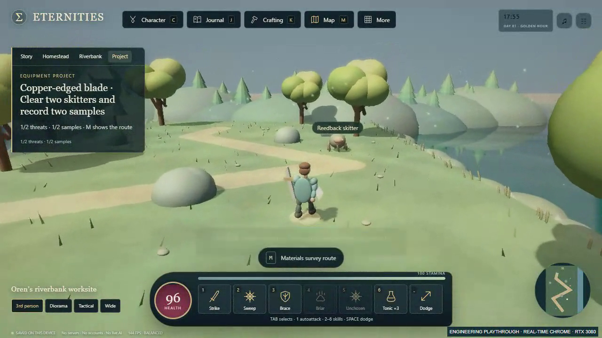
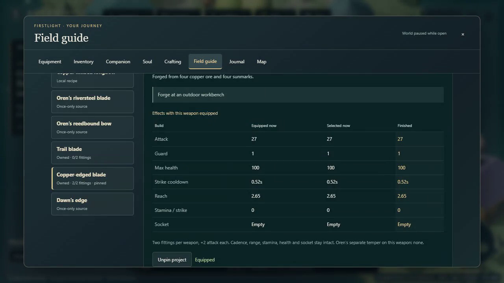
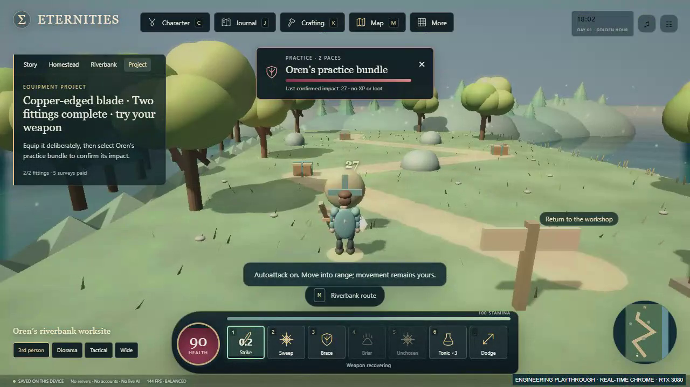

# Actual gameplay: An Upgrade Worth Hunting

[Play the 46-second recording](upgrade-worth-hunting.mp4). It shows the last skitter and sample of an earned fifth materials survey, return and claim, copper blade crafting, two fittings, deliberate equip, both cameras and confirmed 27-damage practice hits. The starting checkpoint already earned the first four payouts and the west half of the fifth outing through `tests/pursuit_journey.cjs`. No save, equipment or rewards were planted for the clip.

Captured at 1280×720 in installed Chrome 153.0.8010.36, headless hardware rendering, ANGLE Direct3D11 on NVIDIA GeForce RTX 3080. Normal real-time RAF with scripted accepted movement/combat commands and actual UI/keyboard input; no accelerated game clock. Browser capture was transcoded to H.264 at its original 25fps and duration, without cuts. This silent recording is not a human playtest or a frame-time benchmark. The live in-game FPS number is not a performance result.

[Gameplay receipt](GAMEPLAY_RECEIPT.json) records build/fixture/video hashes, browser and renderer, normal-RAF method, final state and actual hit events. [Actions](actions.json) and the [earned input checkpoint](run5_02_PARTIAL.json) reproduce the clip with `tools/record_browser_gameplay.py --fixture docs/evidence/upgrade-hunt/run5_02_PARTIAL.json --actions docs/evidence/upgrade-hunt/actions.json --output evidence10/pursuit-recording` and installed hardware Chrome selected in `FIRSTLIGHT_CHROMIUM_EXECUTABLE`.

[Local verification](LOCAL_VERIFICATION.json), [new browser assertions](PURSUIT_BROWSER_REPORT.json) and [earned journey summaries](EARNED_JOURNEYS.json) retain exact results. Full raw local logs are external development artifacts; CI uploads its own logs, fixtures and reports. The implementation PR carries verification of a fresh clone at its exact final pushed commit.
